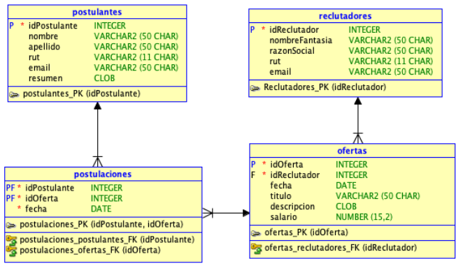

# awakelab-ensayo-reclutamiento

## Problema
La Startup de reclutamiento y vinculación con el empleo "conluquitasbailaelmonito.com", necesita elaborar una prueba de concepto para testear su idea de negocio. Para ello, ha requerido que desarrolle una solución de acuerdo a las reglas de negocio que se detallan más adelante.

Para almacenar los datos necesarios para satisfacer el negocio, se ha diseñado el siguiente modelo de datos:

Las entidades que se describen son las siguiente:

 * **Postulantes**: Describe los datos relevantes del postulante, id, nombre, apellido, rut, email, resumen de experiencia.
 * **Reclutadores**: Describe los datos relevantes del empleador que publica ofertas de empleo: id, nombre de fantasía, razón social, rut, email.
 * **Ofertas**: Describe los datos relevantes de la oferta publicada por el reclutador: id, fecha publicación, titulo, descripción, salario ofertado.
 * **Postulaciones**: Permite registrar una postulación a una oferta.

## Requerimientos Funcionales

 * No te preocupes de autenticación de usuarios ni de perfiles, céntrate en la funcionalidad requerida.
 * Elabora una página web inicial que despliegue un menú que permita ingresar a uno de las secciones de la aplicación: Postulantes o Reclutadores.
 * El menú cambiará dependiendo de la sección que el usuario haya seleccionado: Postulantes verán un menú que permitirá ingresar al registro de su perfil, o a una lista de ofertas donde podrá postular. Los Reclutadores podrán ingresar al registro de nuevos Reclutadores, podrán registrar una nueva Oferta, y podrán revisar los candidatos que han postulado a sus ofertas.

### Postulantes
 * Registro de un Postulante
 * Listado de ofertas disponibles para que el candidato postule a una oferta. El listado de Ofertas, debe ser consumido desde una API REST publicada desde la misma plataforma.

### Reclutadores
 * Registro de un Reclutador.
 * Registro de una Oferta.
 * Listado de Postulantes a Ofertas. Los postulantes deben ser cosumidas desde un API REST publicado desde la misma aplicación.

## Requerimientos No Funcionales
 * El sistema debe ser construido utilizando el framework Spring MVC, conectándose a una base de datos Oracle 11g express.
 * Debe asociar las vistas por medio de vínculos HTML.
 * En las tablas no existen campos autoincrementales.
 * La revisión del problema se realizará en base al modelo antes planteado; no se permite agregar, modificar o quitar campos del modelo.
 * Desarrolle las vistas que requiera para completar la funcionalidad, y utiliza los mockups como referencia, no como una obligación.
